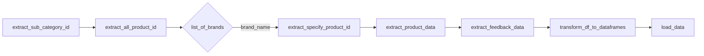
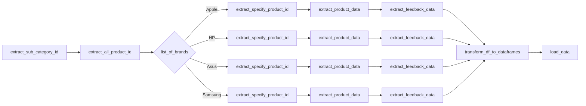

# Data Extraction and Processing Pipeline

## General Process

The general process for data extraction and processing is as follows:

1. `extract_sub_category_id`: Extract the unique identifiers for different subcategories of products from the data source.
2. `extract_all_product_id`: Retrieve all the unique product identifiers from the data source.
3. `list_of_brands`: Iterate through a list of brands.
4. `extract_specify_product_id`: For each brand, extract the specific product IDs that belong to that brand.
5. `extract_product_data`: Extract the detailed product data for the extracted product IDs.
6. `extract_feedback_data`: Extract the feedback data associated with the products.
7. `transform_df_to_dataframes`: Transform the extracted data into manageable dataframes.
8. `load_data`: Load the transformed dataframes into the target system or application.

## Specific Process (Context)

The specific process for data extraction and processing, with example brands (Apple, HP, Asus, Samsung), is as follows:

1. `extract_sub_category_id`: Extract the unique identifiers for different subcategories of products from the data source.
2. `extract_all_product_id`: Retrieve all the unique product identifiers from the data source.
3. `list_of_brands`: Iterate through the list of brands (Apple, HP, Asus, Samsung).
4. `extract_specify_product_id`: For each brand (Apple, HP, Asus, Samsung), extract the specific product IDs that belong to that brand.
5. `extract_product_data`: For each brand (Apple, HP, Asus, Samsung), extract the detailed product data for the extracted product IDs.
6. `extract_feedback_data`: For each brand (Apple, HP, Asus, Samsung), extract the feedback data associated with the products.
7. `transform_df_to_dataframes`: Transform the extracted data for all brands into manageable dataframes.
8. `load_data`: Load the transformed dataframes into the target system or application.

This specific process demonstrates how the data extraction and processing pipeline is executed independently for each brand, allowing for better isolation and handling of issues specific to a particular brand's data.