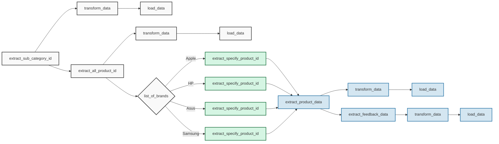
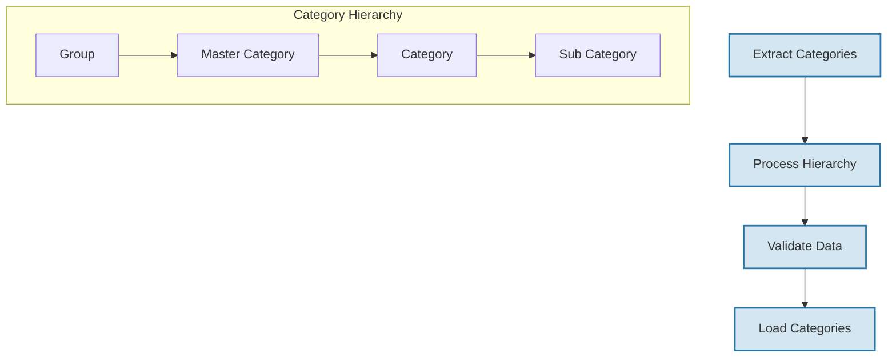
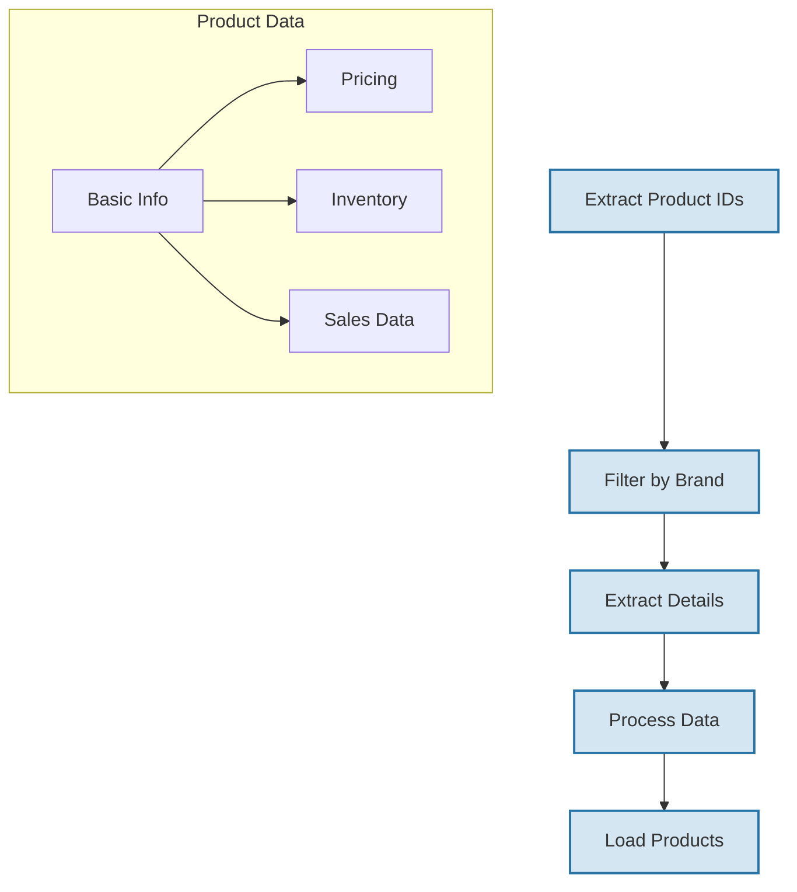

# E-commerce Data Pipeline Project

## Contact
For technical questions or support, please contact:
- Kiet Nguyen
- [WhatsApp](https://wa.me/84914852966)

## Introduction
This repository contains a sophisticated ETL (Extract, Transform, Load) pipeline designed to collect and process e-commerce data from Tiki.vn. The project demonstrates the implementation of a robust data engineering solution that handles product information, customer feedback, and inventory tracking across multiple brands and categories.

## Pipeline Architecture



## Data Processing Flow

### 1. Category Processing
The pipeline begins with category extraction and processing:



### 2. Product Processing
Product data extraction occurs in parallel for each brand:



## Project Structure
```
FinalYearProject/
├── Airflow/               # Airflow configuration files
├── dags/                  # DAG definitions and ETL scripts
│   ├── warehouse/         # Data storage
│   │   ├── category/      # Category hierarchies
│   │   ├── product/       # Product information
│   │   └── feedback/      # Customer feedback data
│   ├── Local_ETL.py       # Main ETL implementation
│   └── Local_function.py  # Helper functions
└── Dashboard/             # Analytics dashboard
```

## Data Models

### Category Schema
Our category management system follows a hierarchical structure:
- **Group**: Top-level categorization
- **MasterCategory**: Secondary classification
- **Category**: Detailed grouping
- **SubCategory**: Specific product types

### Product Schema
The product data model captures comprehensive information:
- **Product**: Core product details
- **ProductSale**: Sales metrics and history
- **Inventory**: Stock management
- **Pricing**: Price tracking and changes
- **Brand**: Brand information
- **Seller**: Seller profiles

### Feedback Schema
Customer feedback is processed through multiple layers:
- **User**: Customer profiles
- **History**: User activity tracking
- **GeneralFeedback**: Aggregated metrics
- **FeedbackDetail**: Individual reviews

## Key Features
Our pipeline implements several sophisticated features:

1. **Automated Data Collection**
   - Regular API polling
   - Incremental updates
   - Error recovery mechanisms

2. **Data Validation**
   - Schema validation
   - Data quality checks
   - Duplicate detection

3. **Processing Pipeline**
   - Parallel processing
   - Brand-specific handling
   - Efficient data transformation

4. **Monitoring System**
   - Real-time alerts
   - Performance metrics
   - Error tracking

## Important Note
This project's data has been collected and prepared by Kiet Nguyen for educational purposes only. The data should not be used for commercial purposes without proper authorization. The pipeline demonstrates data engineering best practices and ETL workflow management in a real-world context.

## License
This project is licensed under the MIT License - see the LICENSE file for details.